<div align="center">
  
</div>

# MATE: Calculadora Dinámica para Estudiantes

## 1. Resumen de la problemática
La fragmentación de herramientas pedagógicas genera un problema en los estudiantes de enseñanza media, quienes deben alternar entre dispositivos de cálculo aritmético, textos de consulta para fórmulas fundamentales y plataformas externas de graficación. Esta dispersión operativa impide la asimilación fluida de los conceptos, aislando la ejecución numérica de su base teórica y su representación geométrica. **MATE** aborda esta carencia mediante un entorno diseñado para fortalecer el aprendizaje matemático a través de la experimentación y una mejor visualización.

## 2. Objetivos del Proyecto
### Objetivo General
Desarrollar una calculadora en C++, la cual cuente con una interfaz visual, que permita resolver operaciones matemáticas, entregar información a modo de formulario para el aprendizaje y que pueda graficar funciones matemáticas animadas, las cuales, formen parte del contexto de enseñanza media en chile, con el fin de apoyar el aprendizaje en estudiantes.

### Objetivos Específicos (Hito 3)

- **Migración de Entorno e Interfaz Gráfica:** Trasladar la arquitectura de software de la calculadora orientada a objetos desarrollada en el Hito 2 hacia un entorno gráfico interactivo implementado con el framework Qt, garantizando el desacoplamiento entre las clases de cálculo y la interfaz de usuario.
- **Integración del Motor de Cálculo Aritmético:** Implementar la totalidad de las funciones matemáticas preexistentes del núcleo de cálculo (suma, resta, multiplicación, división, potencia, raíz cuadrada y logaritmo con base parametrizable) en los componentes visuales de la calculadora principal, asegurando el procesamiento correcto de operaciones y el control de excepciones ante desbordamientos numéricos e indeterminaciones.  
- **Incorporación de Retroalimentación:** Ejecutar las correcciones técnicas, refactorizaciones de código y optimizaciones de diseño sugeridas en las evaluaciones anteriores y durante la presentación presencial del miércoles 24 de junio de 2026.
- **Consolidación del Repositorio de Fórmulas:** Culminar la implementación del módulo de formulario matemático interactivo mediante la carga dinámica de archivos vectoriales, abarcando las propiedades algebraicas, límites y derivadas esenciales de la enseñanza media.
- **Simulación Animada de Funciones:** Desarrollar un lienzo de dibujo cartesiano acotado que renderice curvas matemáticas de forma progresiva y animada de izquierda a derecha, facilitando la visualización del comportamiento de las funciones curriculares escolares.
- **Gamificación Teórico-Práctica:** Diseñar e integrar un entorno de juego educativo estructurado en retos de ajuste paramétrico en tiempo real ("Atrapa la Curva") y cuestionarios interactivos de opción múltiple ("Quiz") para reforzar la comprensión de funciones.  
- **Modelado Gráfico de Fracciones:** Construir un componente gráfico sectorial adaptativo para la representación visual de fracciones, permitiendo al usuario parametrizar numeradores y denominadores para comprender la división geométrica de la unidad.  

## 3. Roles del Equipo
| Integrante | Rol |
| :--- | :--- |
| **Allison** | Frontend / Programadora |
| **Sibel** | Programadora / Editora |
| **Alex** | Administrador de Proyecto |
| **Benjamin** | Programador Backend |
| **Esteban** | Programador de "Incognita Grafica" |

## 4. Requerimientos y Compilación
Para poder compilar y ejecutar el programa de manera local, se debe descargar e instalar los siguientes componentes de software:

### Requisitos del Sistema
- **Entorno de Desarrollo (IDE):** Qt Creator (versión configurada para la gestión de proyectos basados en CMake o qmake).  
- **Framework Qt:** SDK de Qt (versión 6.0 o superior, o versión 5.15 LTS). Durante la instalación, es mandatorio marcar los componentes y bibliotecas adicionales Qt Charts y Qt SVG.  
- **Compilador C++:** Compilador con soporte completo para el estándar C++17 o superior. (GCC 9+ en sistemas basados en Linux, Clang 10+ en macOS, o MSVC 2019+ / MinGW en entornos Windows).  
- **Gestor de Construcción:** Herramienta CMake (versión 3.16 o superior) o qmake integrada de forma directa en las variables de entorno o dentro del kit de Qt Creator.  
- **Control de Versiones:** Cliente Git para la clonación y descarga de la estructura de carpetas desde GitHub. 

### Proceso de instalación

**Paso 1: Instalación de las Dependencias de Qt**

- Ingrese al portal web oficial de Qt (qt.io) y acceda a la sección de descargas para obtener el Qt Online Installer adaptado a su sistema operativo.

- Ejecute el asistente de instalación, inicie sesión con sus credenciales de usuario y continúe hasta la ventana de selección de componentes.

- Despliegue el árbol de versiones, seleccione la distribución instalada (preferentemente Qt 6.x) y asegúrese de activar las casillas correspondientes a las extensiones de desarrollo Qt Charts y Qt SVG. Finalice la instalación completa del SDK.

**Paso 2: Clonación del Código Fuente**

Abra una ventana de terminal (o la consola de comandos de su sistema operativo) y clone el repositorio del proyecto ejecutando la siguiente instrucción de consola:

```
git clone https://github.com/ItzTercer/MATE.git
```

**Paso 3: Configuración del Proyecto en el Entorno Gráfico**

1. Inicie la aplicación Qt Creator en su computadora.

2. En el menú de inicio del entorno, presione el botón Abrir Proyecto (Open Project) y navegue a través de los directorios locales hasta la carpeta donde descargó el código fuente.  

3. Seleccione y abra el archivo de configuración maestro del proyecto, el cual corresponde a **CMakeLists.txt**, el cual estara ubicado dentro de la carpeta *src*.

4. El entorno detectará las dependencias y desplegará una ventana de selección de kits de desarrollo. Marque la casilla correspondiente al compilador y kit de Qt instalados en el paso 1, y presione el botón Configure Project.

5. Permita que el software finalice el proceso de indexación. El entorno compilará de forma automática el archivo de recursos estructurado Font.qrc que incorpora de forma local los iconos y vectores del formulario educativo. 

6. Diríjase al menú lateral izquierdo, haga clic derecho sobre el nombre del proyecto y seleccione Limpiar (Clean) para purgar residuos de compilaciones previas.

7. Compilar y Ejecutar: Presione la combinación de teclas Ctrl + R o haga clic en el botón verde con forma de flecha (Ejecutar) en la esquina inferior izquierda. El entorno procesará el archivo de recursos Font.qrc y desplegará la interfaz principal automáticamente.

## 5. Evolución del Proyecto (Hito 1 a Hito 3)

El desarrollo del software educativo **MATE** transitó por un proceso evolutivo estructurado en tres etapas de desarrollo incremental, transitando desde un núcleo matemático básico en consola hasta una plataforma gráfica interactiva desacoplada y multifuncional.

### Hito 1: Fundamentación Conceptual y Núcleo Aritmético Base
*   **Definición del Dominio:** Se estableció la arquitectura inicial del proyecto enfocada en resolver la abstracción operacional en la enseñanza media.
*   **Desarrollo del Motor Analítico:** Se implementaron los algoritmos aritméticos fundamentales en código nativo, incluyendo operaciones binarias acumulativas, radicación, potencias y el manejo de las constantes macro $\pi$ y $e$, verificando sus capacidades mediante pruebas iniciales.
*   **Control de Versiones y Flujo de Trabajo:** Se reestructuró y recreó el repositorio central en GitHub para adoptar de manera estricta la metodología de trabajo basada en la organización de *Issues*, *Milestones* y asignación de roles.
*   **Prototipado Gráfico:** Se realizaron las primeras aproximaciones y pruebas prácticas sobre visualización analítica de funciones como preparación técnica para los requerimientos del sistema.

### Hito 2: Transición Estructural a la Programación Orientada a Objetos (POO)
*   **Migración de Paradigma:** El código base fue refactorizado por completo bajo el estándar de C++, aplicando los conceptos de modularidad, encapsulamiento y abstracción abordados en la cátedra.
*   **Abstracción de Clases:** Se aislaron las responsabilidades numéricas mediante el diseño de componentes dedicados al cálculo, optimizando la precisión de las operaciones y la flexibilidad del motor matemático.
*   **Subsanación de Observaciones:** Se integraron de manera exhaustiva todas las correcciones de diseño lógico y optimización sugeridas en la revisión del equipo docente, trazando las metas específicas necesarias para escalar el proyecto hacia la etapa final.

### Hito 3: Entorno Gráfico Unificado (Framework Qt) y Extensiones Pedagógicas
*   **Desarrollo de la Interfaz de Usuario (GUI):** Se realizó la migración definitiva de la vista hacia el framework Qt Widgets, implementando interfaces responsivas provistas de barras de navegación, botones, controles numéricos y un lienzo cartesiano interactivo basado en `QPainter`.
*   **Implementación de Mecanismos de Conexión:** Se integró el sistema de *Signals* y *Slots* de Qt para comunicar los eventos de la interfaz con los métodos analíticos internos, logrando un desacoplamiento efectivo entre la lógica del dominio y la capa de presentación.
*   **Incorporación de Módulos Educativos:** Se expandió el alcance del software mediante la creación de herramientas complementarias alineadas con el currículum de enseñanza media en Chile: el repositorio interactivo de fórmulas (Formulario), el widget gráfico de división para fracciones y el entorno gamificado interactivo de ajuste paramétrico ("Incógnita Gráfica").
*   **Consolidación y Cierre:** El proyecto concluyó incorporando la retroalimentación recibida durante la Presentacion presencial del miércoles 24 de junio de 2026, validando la estabilidad del sistema mediante la documentación de casos de prueba y logrando a cabalidad el objetivo general propuesto.


## 6. Descripción de las Clases Principales, Responsabilidades y Relaciones

El sistema se estructura bajo un diseño orientado a objetos que distribuye las tareas de control de interfaz, renderizado y procesamiento matemático en unidades modulares independientes:

* **`MainW` (Clase Principal):** Actúa como el controlador central de la aplicación y administra la ventana principal del software. Es responsable de inicializar la barra lateral de navegación (`widgetMenu`), capturar los eventos del teclado numérico y operacional de la calculadora, actualizar las pantallas de visualización (`display1` y `display2`) y gestionar la carga dinámica del formulario matemático.
* **`Calc` (Núcleo Matemático):** Clase o conjunto de funciones independientes de la interfaz encargadas de la computación aritmética pura. Provee el soporte para operaciones básicas, potencias, cálculo logarítmico con base parametrizable y almacena los valores numéricos de alta precisión para las constantes macro `constante_pi` y `constante_e`.
* **`GraficadoraWindow` (Módulo de Gráficos):** Ventana secundaria encargada del entorno de graficación interactiva. Controla el ciclo de vida del temporizador (`QTimer`) que dicta la animación del trazo y gestiona el componente de selección de funciones (`QComboBox`).
* **`CanvasGraficadora` (Lienzo Cartesiano):** Subclase especializada de `QWidget` embebida dentro de la ventana de gráficos. Su única responsabilidad es el renderizado gráfico de bajo nivel mediante `QPainter`, encargándose de dibujar la cuadrícula de fondo, los ejes coordenados, las etiquetas numéricas de escala y el vector de la curva matemática de forma progresiva.
* **`VentanaJuego` / `Módulo de Fracciones`:** Componentes dedicados a la extensión pedagógica. Administran de forma autónoma la lógica del juego de ajuste paramétrico ("Atrapa la Curva"), el banco de preguntas ("Quiz") y el widget de división sectorial para representar fracciones en tiempo real.

### Relaciones entre Clases

* **Composición y Agregación:** `MainW` contiene y gestiona los punteros de las ventanas secundarias (`GraficadoraWindow`, `VentanaJuego`). A su vez, `GraficadoraWindow` compone internamente un objeto de tipo `CanvasGraficadora` mediante agregación para delegar el dibujo del plano cartesiano.
* **Asociación Funcional / Dependencia:** `MainW` depende directamente de las funciones de la capa `Calc`. Cuando el usuario gatilla una operación matemática, `MainW` invoca los métodos estáticos o subrutinas de `Calc` pasando los parámetros crudos, procesando el resultado devuelto de forma aislada a la interfaz.

---

## 7. Interfaz Desarrollada: Objetivo, Widgets, Flujo y Parametrización

### Objetivo de la Interfaz
El entorno gráfico de **MATE** tiene como objetivo mitigar la abstracción conceptual en estudiantes de enseñanza media mediante un espacio unificado. 

### Widgets Principales
* **`QToolButton`:** Utilizados exclusivamente en la barra lateral izquierda (`widgetMenu`) con iconos puros para conmutar de manera limpia entre los diferentes módulos del programa.
* **`QPushButton`:** Conforman el teclado de la calculadora matemática, incluyendo accesos directos para las constantes, operadores estándar y funciones logarítmicas.
* **`QLineEdit` y `QLabel`:** Actúan como la pantalla de la calculadora (Display de expresión previa y Display de resultado actual con soporte para alertas de "Error").
* **`QSvgWidget`:** Incorporado dentro del layout adaptativo del contenedor de fórmulas para cargar y escalar dinámicamente archivos vectoriales `.svg` sin pérdida de definición.
* **`QComboBox`:** Selector desplegable en el módulo de gráficos que permite conmutar la función matemática activa del plano cartesiano.

### Flujo de Uso
1. **Cálculo Operacional:** El usuario interactúa con el teclado numérico o introduce valores en los campos de la calculadora básica para obtener resultados directos.
2. **Consulta Teórica:** Al presionar el botón correspondiente en el menú lateral, la interfaz despliega el Formulario Matemático estructurado jerárquicamente en un `QToolBox`. El usuario expande las pestañas (Límites, Derivadas, etc.) para estudiar las propiedades de la materia.
3. **Visualización Gráfica:** Al acceder al módulo de graficación, se abre una ventana independiente con el plano cartesiano por defecto. El usuario selecciona una función de la lista y el software ejecuta de manera automática el trazado animado de izquierda a derecha en los ejes de -10 a 10.
4. **Validación y Juego:** El estudiante ingresa a los módulos de fracciones o juego para resolver los desafíos interactivos basándose en los conceptos calculados previamente.

### Forma de Parametrización
La introducción y modificación de variables dentro del sistema se realiza mediante tres mecanismos claros en la interfaz:
* **Entrada Numérica Directa:** Clics sobre los botones de la interfaz gráfica que inyectan caracteres numéricos o las macros constantes $\pi$ y $e$ al display.
* **Cuadros de Diálogo Modales (`QDialog`):** Al presionar funciones complejas como el logaritmo, un cuadro de diálogo bloquea la pantalla exigiendo ingresar por texto (`QLineEdit`) los parámetros específicos de la operación ("Base" y "Argumento"), soportando tanto números reales como strings literales (`"pi"`, `"e"`).
* **Control de Selección de Estado (`QComboBox`):** Permite cambiar el tipo de función a graficar indexando directamente la ecuación matemática que procesará el motor del lienzo.

---

## 8. Separación entre Lógica de Dominio e Interfaz de Usuario

El proyecto presenta el principio de separación de responsabilidades, asegurando que el motor numérico sea independiente de la representación visual.

* **Capa de Interfaz (Vista y Controladores):** Representada por `MainW`, `GraficadoraWindow`, `CanvasGraficadora` y los archivos de diseño XML de Qt (`mainw.ui`). Su única función es la captura de señales periféricas del usuario, el formateo de hilos de texto, la gestión de layouts responsivos y la ejecución de rutinas de dibujo estético (`QPainter`). Esta capa no realiza operaciones algebraicas internas ni determina el dominio de una función.

* **Capa de Lógica del Dominio (Modelo Matemático):** Centralizada en los archivos `calc.h` y `calc.cpp`. Contiene las variables numéricas primitivas de alta precisión (`double`), las ecuaciones puras y los algoritmos de filtrado como `verificador_infinito` o las macros analíticas `std::isinf` y `std::isnan`. Esta capa opera en aislamiento conceptual: recibe números de entrada, computa y devuelve números de salida.
* **Mecanismo de Conexión (Signals y Slots):** El puente entre ambas capas se realiza de manera controlada. Cuando la interfaz detecta un evento (ej. clic en el botón de igualdad), extrae las cadenas de texto de los widgets, las convierte a tipos de datos nativos de C++ y llama a las funciones de cálculo de la capa lógica. El resultado numérico es devuelto a la interfaz, la cual se encarga de formatearlo (con la precisión de dígitos configurada) y refrescar los elementos visuales de la pantalla. Si la lógica detecta un valor fuera de dominio, retorna una excepción o indeterminación que la interfaz traduce visualmente como "Error", protegiendo la integridad del programa sin mezclar código de control gráfico con operaciones matemáticas fundamentales.


## 9. Casos de Prueba (Validación)

### 1. Módulo de Calculadora Principal

#### Caso de Prueba 1.1: Operación de Suma Estándar
*   **Entrada:** Presionar secuencia de dígitos `5`, operador `+`, dígitos `5`, `5`, e igual ` = `.
*   **Acción:** El motor computa la adición binaria y limpia la pila operativa.
*   **Resultado Esperado:** El display secundario muestra la expresión evaluada `5 + 55 =` y el display principal muestra de forma estática el valor `60`.

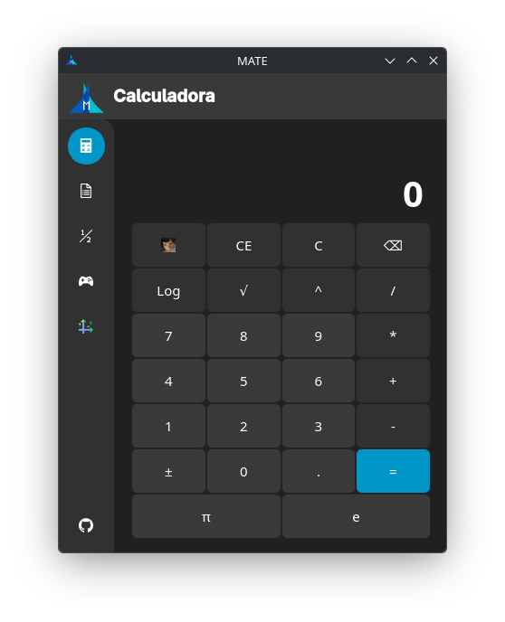
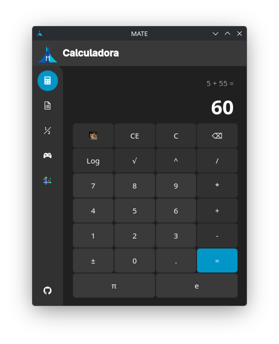

#### Caso de Prueba 1.2: Cálculo de Potencia Entera Elevada
*   **Entrada:** Introducir base `9`, presionar operador de potencia `^`, introducir exponente `6`, y presionar ` = `.
*   **Acción:** Computación de la función de potencia exponencial interna.
*   **Resultado Esperado:** Despliegue del resultado numérico entero `531441`.

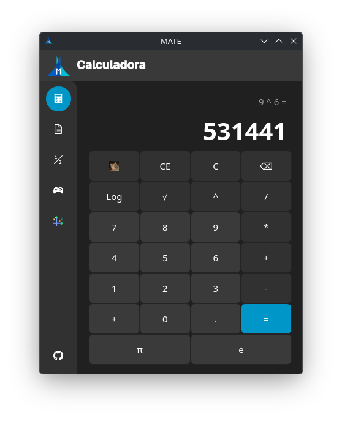

#### Caso de Prueba 1.3: Gestión de Restricciones Matemáticas (Raíz Cuadrada Negativa)
*   **Entrada:** Introducir `0`, restar `6`, presionar ` = ` para obtener un valor negativo en el display. Posteriormente, presionar el botón de raíz cuadrada `√`.
*   **Acción:** El sistema intercepta el valor menor a cero previo a la llamada del método matemático, gatillando el sistema de mitigación de desbordamiento de la interfaz.
*   **Resultado Esperado:** El display de expresión muestra `sqrt indef` y la pantalla principal se bloquea mostrando la palabra `Error`.


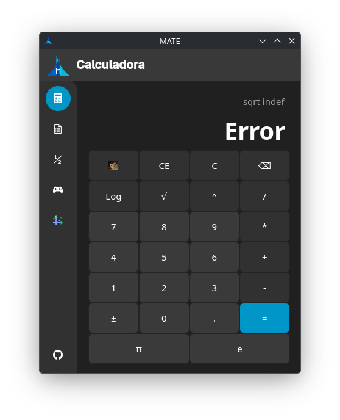

---

### 2. Función Logarítmica Parametrizada

#### Caso de Prueba 2.1: Logaritmo Natural por Diálogo Modal con Base Literal
*   **Entrada:** Presionar el botón `Log`. En el cuadro de diálogo emergente, escribir la letra `e` en el campo "Base" y el dígito `5` en el campo "Argumento". Presionar `OK`.
*   **Acción:** La función lambda de parseo procesa la cadena literal `"e"`, asigna la macro constante `constante_e` y ejecuta el cambio de base mediante logaritmo neperiano.
*   **Resultado Esperado:** El display superior muestra la nomenclatura formal `log_e(5)` y la pantalla principal renderiza el resultado con alta precisión: `1.60943791243`.

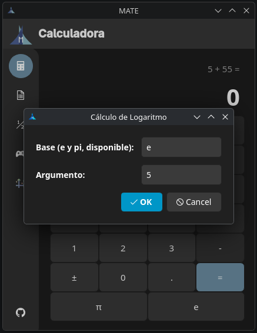
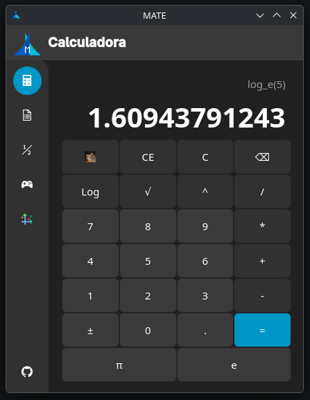

---

### 3. Formulario Matemático Interactivo

#### Caso de Prueba 3.1: Despliegue de Propiedades de Logaritmos
*   **Entrada:** Hacer clic en el segundo botón de la barra lateral izquierda (Icono de documento).
*   **Acción:** El controlador despliega la ventana del formulario y lee las propiedades indexadas. El usuario expande la pestaña "Logaritmos" y hace clic en "Cancelación".
*   **Resultado Esperado:** Carga y escalado nítido del archivo vectorial correspondiente a la ecuación $a^{\log_a(X)} = X$ renderizada en color estructurado sobre fondo oscuro.

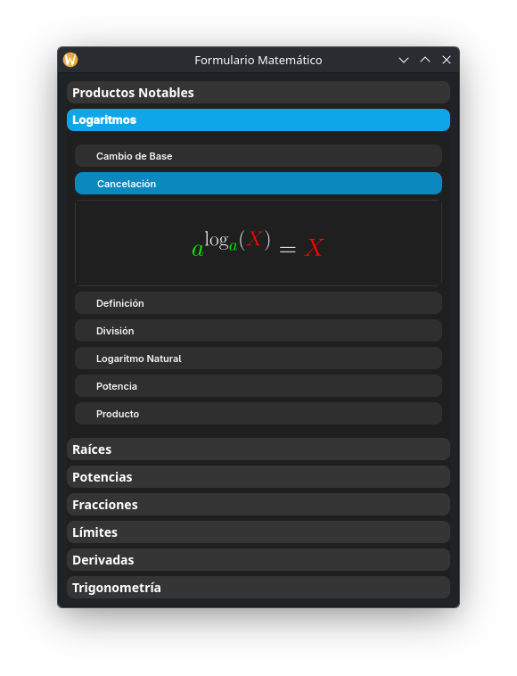

---

### 4. Representación Gráfica de Fracciones

#### Caso de Prueba 4.1: Modelado Sectorial de Fracción Propia
*   **Entrada:** Hacer clic en el tercer botón de la barra de navegación (Fracciones). Configurar los campos numéricos en Numerador: `5` y Denominador: `8`. Hacer clic en `Graficar`.
*   **Acción:** La vista divide el objeto circular en 8 sectores simétricos idénticos y rellena con el color de la paleta institucional exactamente 5 de ellos.
*   **Resultado Esperado:** Actualización inmediata del widget sectorial mostrando la división geométrica exacta de $\frac{5}{8}$.

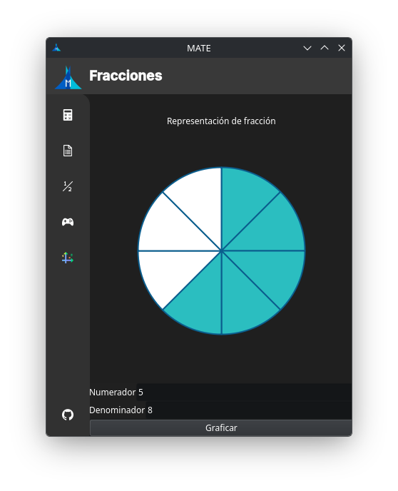

---

### 5. Graficadora de Funciones Animadas

#### Caso de Prueba 5.1: Trazado Progresivo de Función Lineal y Exponencial
*   **Entrada:** Hacer clic en el botón de gráfica de la barra lateral (Icono cartesiano). Seleccionar "Lineal (y = x)" en el combo box. Repetir el proceso seleccionando "Exponencial (y = e^x)".
*   **Acción:** El temporizador reinicia el trazo en $X = -10$ y avanza pintando la curva de izquierda a derecha de forma fluida a 60 FPS hasta alcanzar $X = 10$.
*   **Resultado Esperado:** Renderizado dinámico de la línea recta intersecando el origen y de la curva exponencial barriendo el plano cartesiano con marcas numéricas explícitas en los ejes.

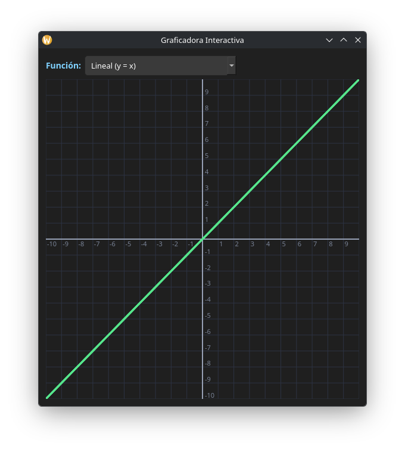
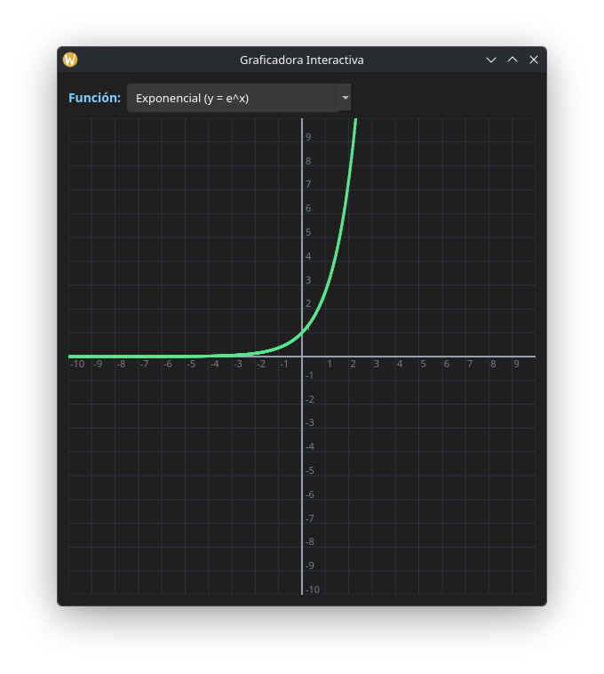

---

### 6. Módulo de Juego: "Incógnita Gráfica"

#### Caso de Prueba 6.1: Menú, Mapa de Progresión y Flujo de Validación del Juego
*   **Entrada:** Seleccionar el icono de control de juego en la barra lateral, presionar `Jugar` en el menú principal e ingresar al "Mundo 1: Rectas".
*   **Acción:** El entorno inicializa las variables de juego (Puntaje base, 3 vidas fijas) y despliega una recta objetivo punteada en color azul en el mapa cartesiano de juego.
*   **Importante:** Este apartado tiene sus propias instrucciones para jugar, precionando el boton "Como jugar", en el menu principal, dentro del programa.
*   **Resultado Esperado:** 
    *   Si los sliders de los parámetros $a$ (pendiente) y $b$ (desplazamiento) no corresponden a la ecuación objetivo, la precisión se mantiene en 0% mostrando el aviso de reintento en texto rojo.
    *   Al ajustar correctamente los controles a los valores objetivo ($a=1$, $b=0$), la barra de precisión se eleva al 100%, la curva verde cubre la línea guía y el juego otorga `+90 puntos`, desbloqueando el avance en el Mapas de Mundos del perfil del estudiante.

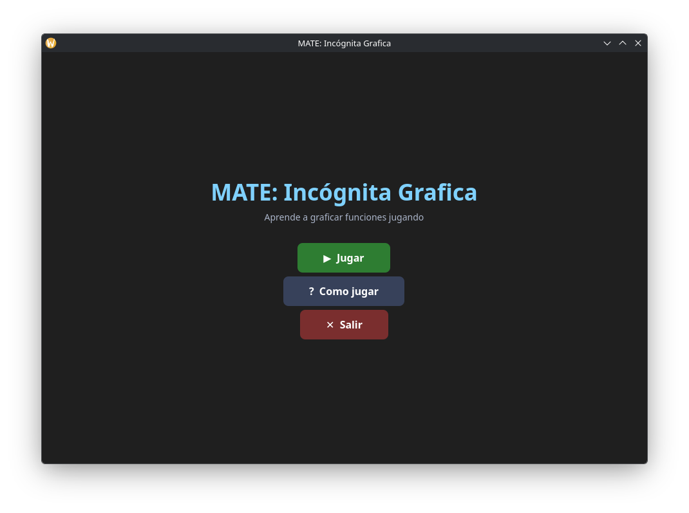
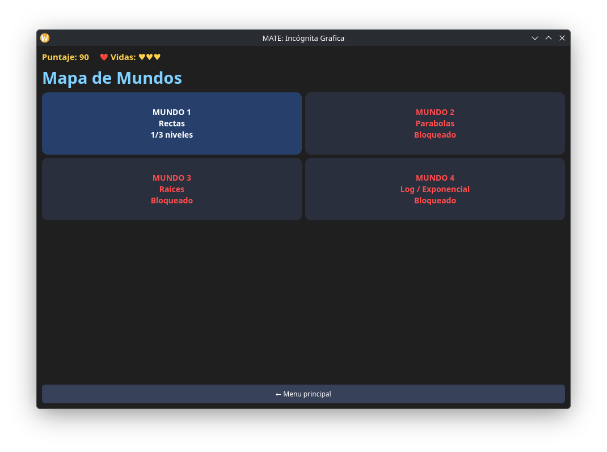
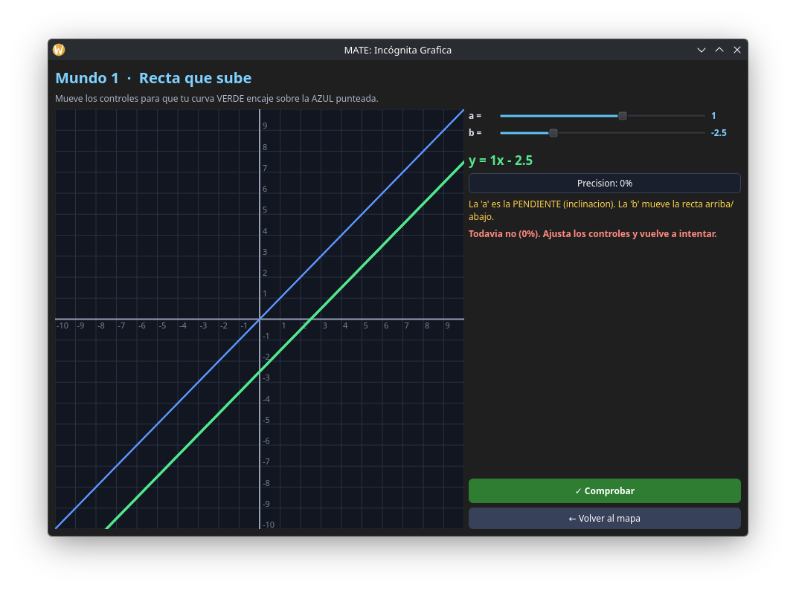
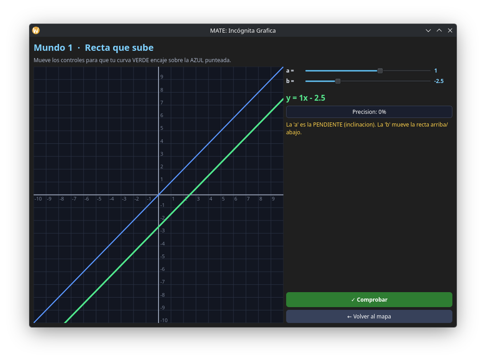
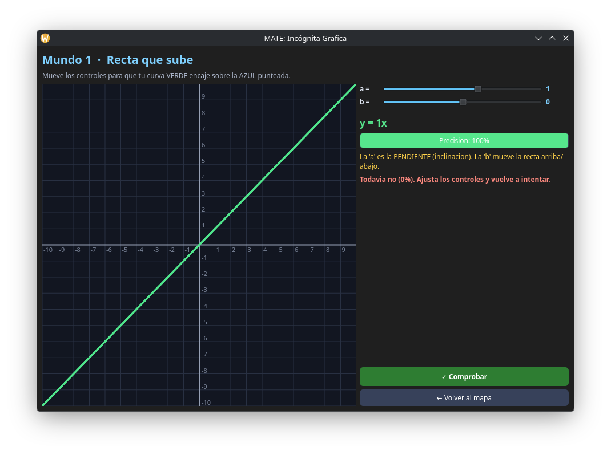
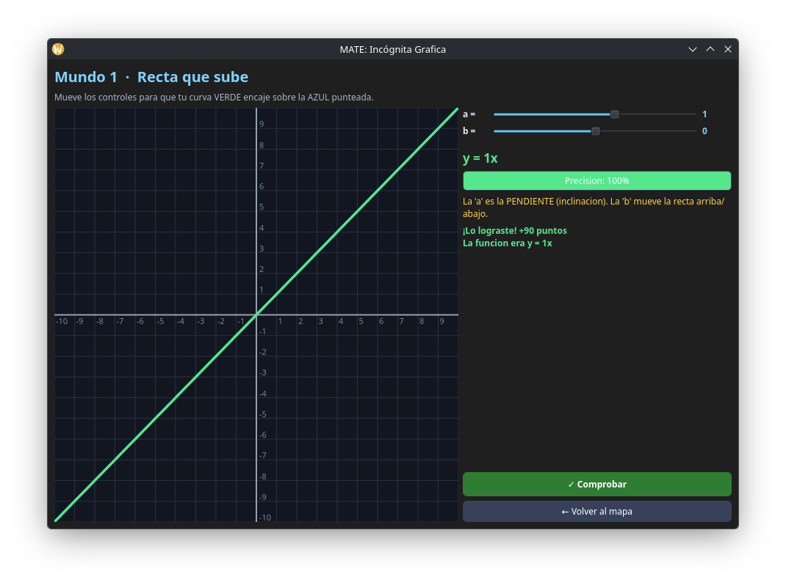

## 10. Retroalimentación Presencial y Modificaciones

A partir de las observaciones entregadas por la comisión evaluadora durante la presentacion presencial del proyecto el miércoles 24 de junio de 2026, se ejecutaron las siguientes modificaciones.

### 1. Desacoplamiento del Formulario Matemático

*   **Comentario:** Mantener el formulario dentro del contenedor principal limitaba el espacio de visualización y obligaba al usuario a alternar pestañas de forma síncrona, interrumpiendo el flujo de cálculo aritmético. Se solicitó independizarlo en una ventana externa.

*   **Modificación:** Se aisló la lógica de carga de recursos vectoriales y se encapsuló en una clase secundaria heredera de `QWidget` llamada `FormularioWindow`. Ahora, al presionar el botón de acceso en la barra lateral, el formulario se despliega en una interfaz paralela e independiente, permitiendo al estudiante consultar identidades y propiedades algebraicas de forma simultánea mientras opera la calculadora principal.

### 2. Culminación e Integración de Sistemas Gráficos
*   **Comentario:** Completar de manera estricta todas las funcionalidades de despliegue gráfico y visualización cartesiana requeridas para la enseñanza media, asegurando un control preciso sobre las curvas y la escala.

*   **Modificación:** Se finalizó el desarrollo del motor gráfico mediante las clases `GraficadoraWindow` y `CanvasGraficadora`. Se implementó el renderizado dinámico guiado por un temporizador `QTimer` a 60 FPS con avance de trazo progresivo, marcas numéricas explícitas en ambos ejes, control de asíntotas mediante macros de punto flotante (`std::isfinite`) y un selector interactivo `QComboBox` para conmutar entre funciones lineales, cuadráticas, raíz, exponenciales, logarítmicas y trigonométricas básicas (seno, coseno, tangente).

---

## 11. Conclusiones y Mejoras Futuras

### Conclusiones
* Se desarrolló una herramienta informática unificada en C++ que cumple con los requisitos curriculares de la enseñanza media en Chile.

* La separación entre la capa de procesamiento matemático abstracto (`Calc`) y las vistas gráficas (`MainW`, `GraficadoraWindow`) demostró que la arquitectura orientada a objetos simplifica la mantenibilidad del código y la integración de nuevas vistas periféricas sin alterar el núcleo.

* La combinación de un entorno computacional con componentes gráficos sectoriales para fracciones y un sistema gamificado interactivo ("Incógnita Gráfica") dota al estudiante de un laboratorio experimental que asocia inmediatamente la variación paramétrica algebraica con su comportamiento geométrico directo.

### Mejoras Futuras
*   **Motor de Parseo de Expresiones Libres:** Sustituir el selector estructurado `QComboBox` por un intérprete de expresiones matemáticas basado en el algoritmo de *Shunting-yard*. Esto permitiría al estudiante ingresar cadenas de texto arbitrarias (ej. `y = 3*x^2 + 2*x - 5`) y graficar cualquier función analítica en tiempo real.

*   **Exportación de Reportes Geométricos:** Añadir rutinas de renderizado a archivos externos utilizando `QPixmap::save` o módulos de PDF, posibilitando que los estudiantes exporten las gráficas animadas generadas y las incorporen directamente en informes o tareas escolares.


## 12. Gestión del Proyecto en GitHub

* **Milestone Hito 3:** Configurado de forma activa en la plataforma, vinculando la fecha límite de entrega con los objetivos de desarrollo y las tareas específicas asociadas a este ciclo de cierre.
* **Project Board:** Tablero continuo (mismo utilizado en Hito 1 y Hito 2) estructurado mediante un flujo de trabajo segmentado en columnas de "No considerado" (To-Do), "En progreso" (Doing) y "Finalizado" (Done). Posee una clasificación interna clara que diferencia las tareas de acuerdo a cada hito, evidenciando de forma directa el desplazamiento y la finalización de las actividades correspondientes a esta tercera entrega.
* **Issues:** Documentación técnica de actividades y tareas individuales, las cuales cuentan con asignación explícita de integrantes del grupo como responsables, etiquetas (*labels*) de categorización y trazabilidad directa hacia el *milestone* del Hito 3.
* **Evidencia de Commits:** Registro de confirmaciones (*commits*).
* **AI_USAGE.md:** Mantenimiento y actualización estricta del archivo de registro de uso de IA generativa.

---

## 13. Anexos y Referencias

### Enlaces Oficiales del Proyecto
* **Repositorio de GitHub:** https://github.com/ItzTercer/MATE

### Documentación Adicional
* **`AI_USAGE.md`:** Registro detallado de herramientas, prompts, observaciones y limitaciones de los modelos de inteligencia artificial generativa empleados durante la migración del código.
* **`Font.qrc`:** Archivo descriptor del sistema de recursos de Qt que compila e inserta localmente los iconos de navegación lateral, los elementos multimedia del entorno lúdico y las ecuaciones matemáticas vectoriales en formato `.svg`.
* **`CMakeLists.txt` / Archivo de Proyecto:** Script de construcción automatizado que parametriza las banderas del compilador bajo el estándar C++17 y vincula estáticamente los módulos `QtWidgets`, `QtCharts` y `QtSvg`.

### Referencias Técnicas y Bibliográficas
* **The Qt Company.** (2026). *Qt Widgets, Qt Charts & Qt SVG Modules Reference Documentation (v6.x)*. Especificaciones de API y componentes gráficos de control. Disponible en: https://doc.qt.io/.
* **Biblioteca Estándar de C++ (`cppreference.com`):** Documentación técnica utilizada para la implementación de métodos matemáticos de alta precisión, manejo de constantes numéricas primordiales y algoritmos de control de desbordamiento u operaciones indeterminadas (`std::isinf`, `std::isnan`).
* **Estándar de Secuencias de Escape ANSI:** Documentación técnica referente a la manipulación de colores y formatos de salida en consolas POSIX, utilizada como base de depuración en las etapas iniciales de prototipado del núcleo analítico.